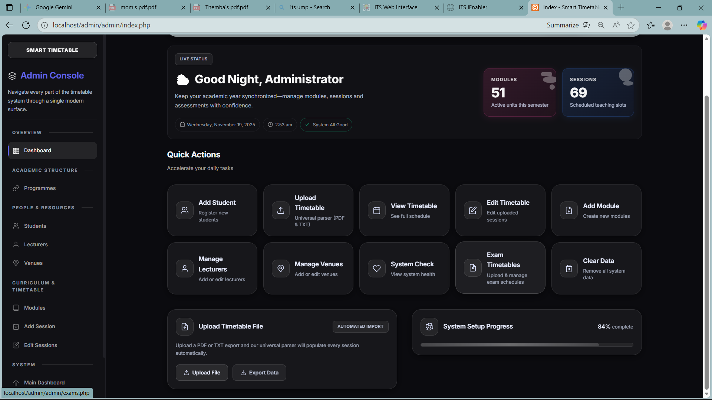
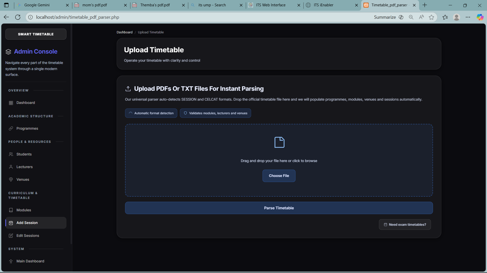
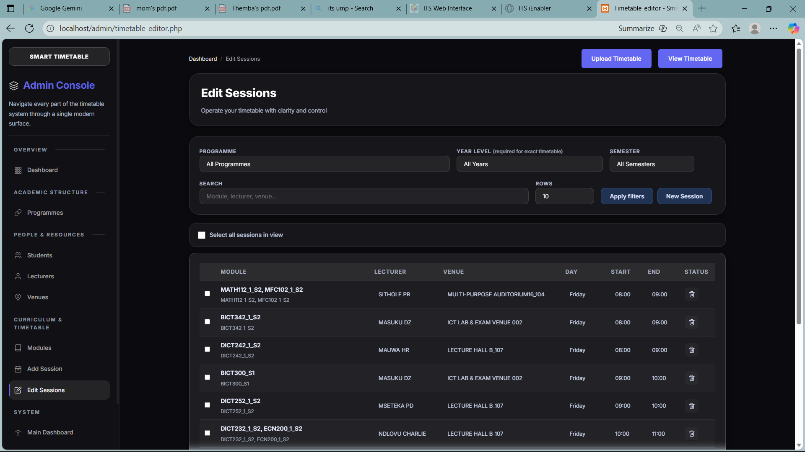
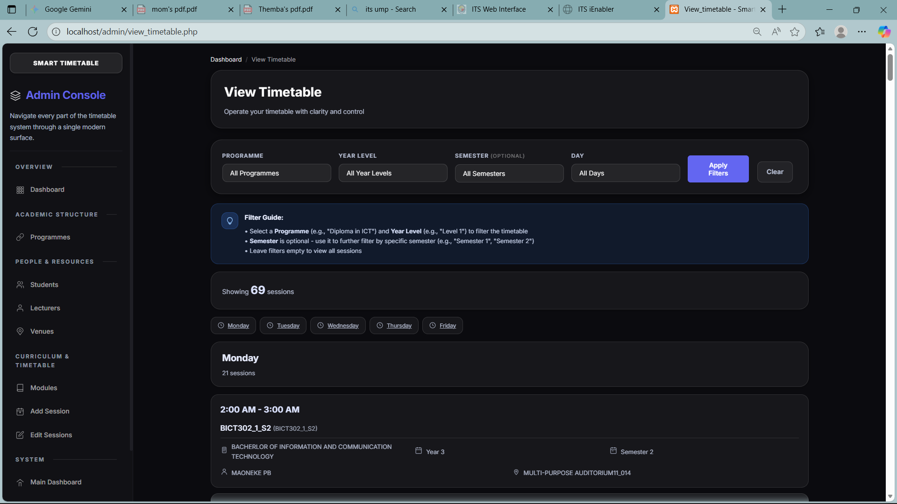
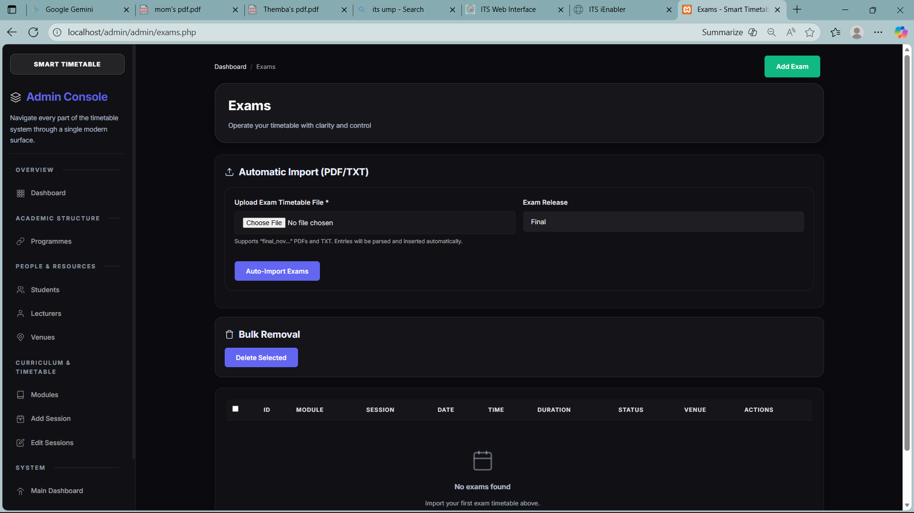
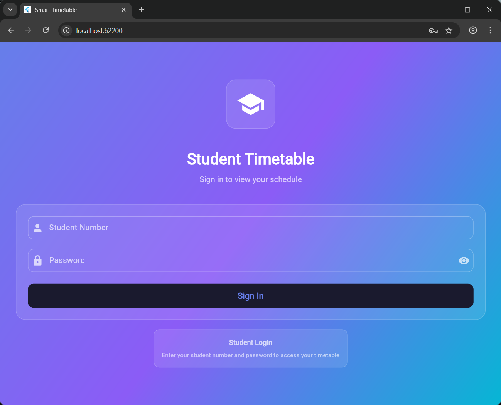
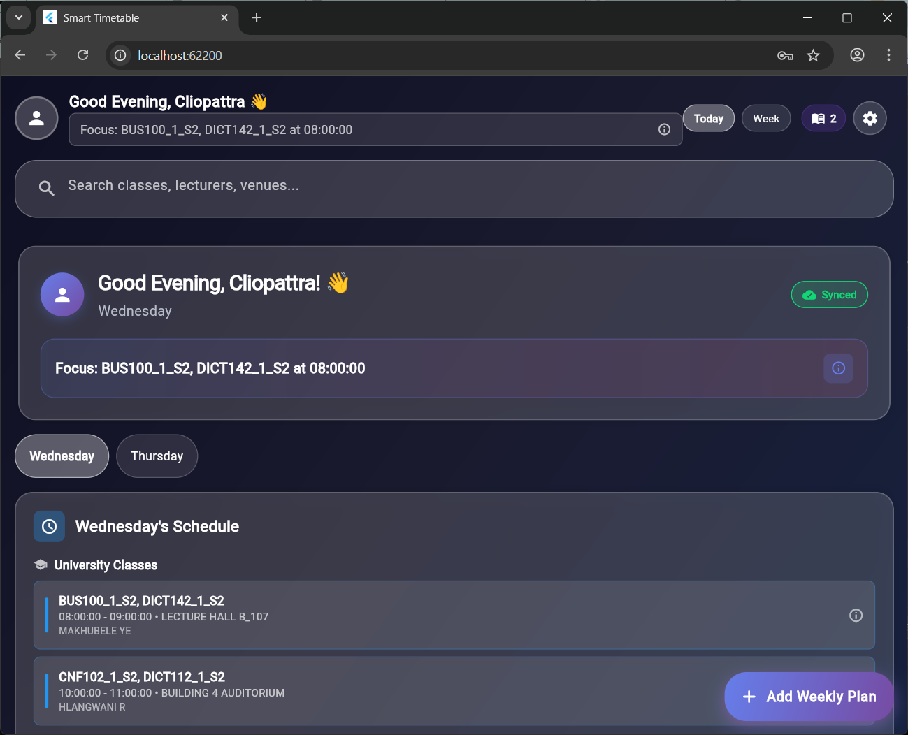
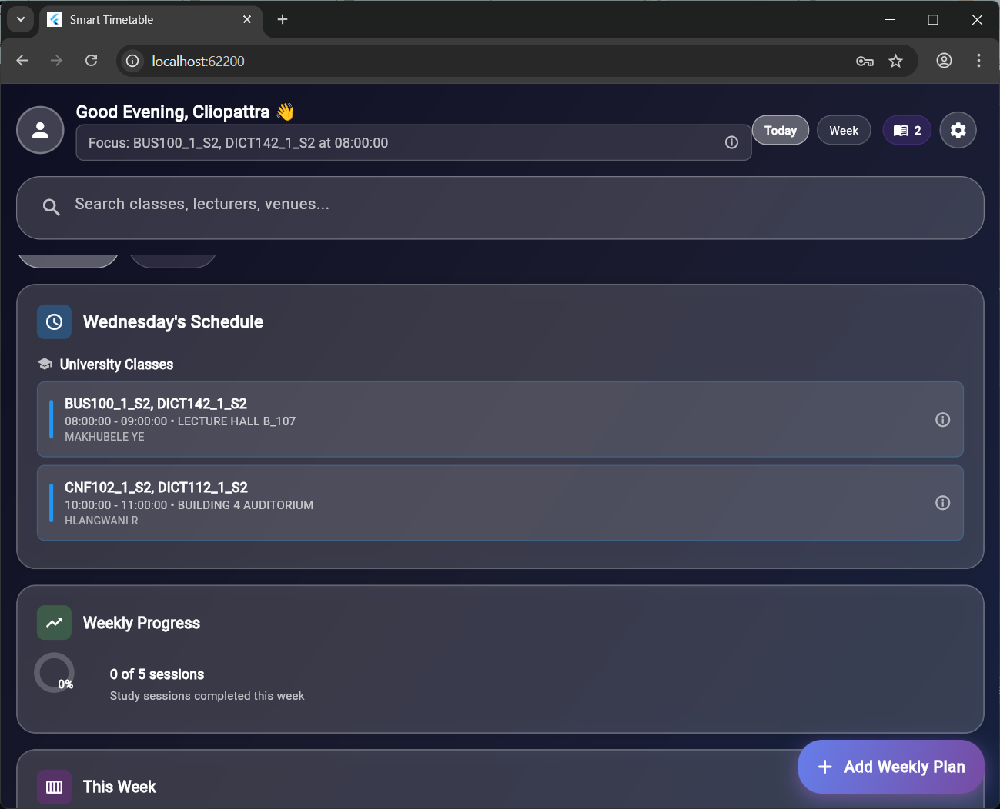
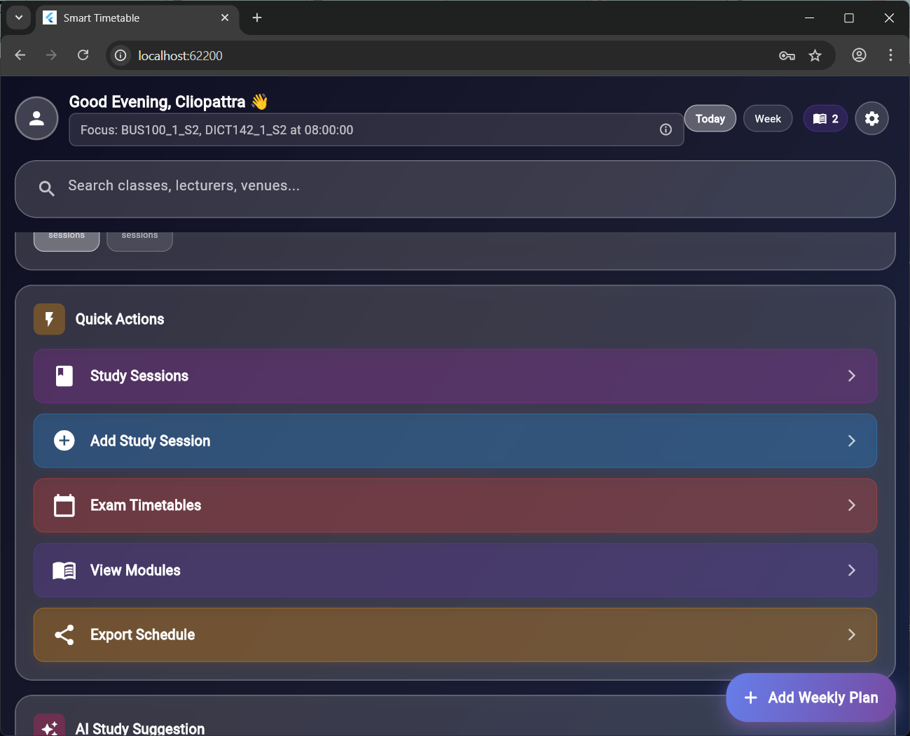
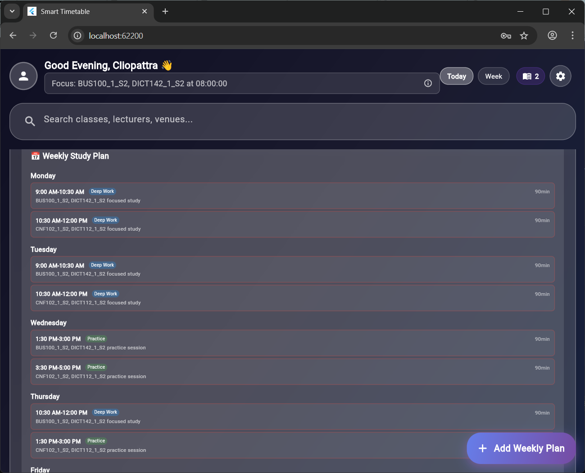

# Smart Timetable Management System

A timetable management system I built for my university project. It includes a Flutter mobile app for students and a PHP web interface for administrators to manage everything.

## What This Does

Basically, it's a system that helps universities manage class schedules. Students can view their timetables on their phones, and admins can create schedules, manage modules, and handle all the admin stuff through a web interface.

## Features

### For Students (Mobile App)
- Login with student number and password
- View your daily and weekly timetable
- See all your enrolled modules
- Create and track study sessions
- Built-in study timer
- Check exam schedules and get notifications
- Works offline once you've loaded your data

### For Admins (Web Interface)
- Manage students - add, edit, view all student info
- Manage modules - create courses, assign to programs
- Manage lecturers - add lecturer details
- Manage venues - add classrooms and locations
- Create timetables - schedule classes, assign lecturers and venues
- Manage exams - schedule exams and send notifications
- Bulk import/export - handle large amounts of data at once
- Search and filter - find anything quickly

## Tech Stack

**Frontend:**
- Flutter (for the mobile app)
- Dart

**Backend:**
- PHP
- MySQL
- REST APIs for communication between app and server

**Tools:**
- XAMPP for local development
- Composer for PHP packages
- PDO for database stuff

## Project Structure

The backend PHP files are in the admin folder, and the Flutter mobile app is in a separate folder. The admin folder has all the API endpoints, database connection files, and the web interface for managing everything.

## Setup

**What you need:**
- XAMPP (with PHP and MySQL)
- Flutter installed
- Android Studio or VS Code
- Composer (for PHP stuff)

**Getting it running:**

1. **Database:**
   - Open phpMyAdmin
   - Import `database_setup.sql` to create all the tables

2. **Backend:**
   - Put the admin folder in your XAMPP htdocs
   - Update database settings in `admin/config.php` (usually just leave it as default for XAMPP)
   - Run `composer install` if needed

3. **Mobile App:**
   - Open the Flutter project in Android Studio
   - Run `flutter pub get`
   - Update the API URL in `lib/config/app_config.dart`:
     - For emulator: `http://10.0.2.2/admin`
     - For real phone: `http://YOUR_COMPUTER_IP/admin`
   - Run the app

## API Endpoints

The mobile app talks to these PHP files:

**Login:**
- `student_login_api.php` - Students log in here

**Timetable:**
- `get_student_timetable.php?student_id=X` - Gets a student's class schedule
- `get_student_exam_timetable.php?student_id=X` - Gets exam schedule

**Modules:**
- `student_modules_api.php?student_id=X` - Gets modules a student is enrolled in
- `fetch_all_modules.php` - Gets all available modules

**Profile:**
- `update_student_profile.php` - Update student info
- `change_password_api.php` - Change password

## Database

Main tables in the database:
- students - stores student info
- modules - course modules
- sessions - class timetable entries
- lecturers - lecturer details
- venues - classrooms and locations
- exams - exam schedules
- student_modules - links students to their enrolled modules

## About This Project

I built this for my ICT Application Development course at University of Mpumalanga. It was a good way to learn full-stack development - I got to work with databases, APIs, and mobile app development all in one project.

## Screenshots

### Admin Interface

### Student Mobile App

## Author

**Themba Ubisi**
- GitHub: [@ReginalThembaubisi](https://github.com/ReginalThembaubisi)

## License

Educational use only.

---

Note: This was built for educational purposes but could be adapted for real university use.

